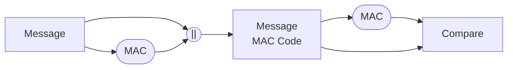

**MAC**: **M**essage **A**uthentication **C**ode.
**HASH** Function: Accepts variable size message M as input and generates a fixed size output called as hash code $H(M)$. -> Also called message digest or hash value.

Depends/done with the help **message**/**plain text**.

Mac and Hash coexist or are useful together. Uske aalawa they are pretty useless

Good stuff but not exactly what we wanted.

**MAC** Block: It is the block where a simple/complex function is performed to generate the MAC code using a key ***K***.

![[MAC Code and Hash Code 2023-04-04 14.08.13.excalidraw)