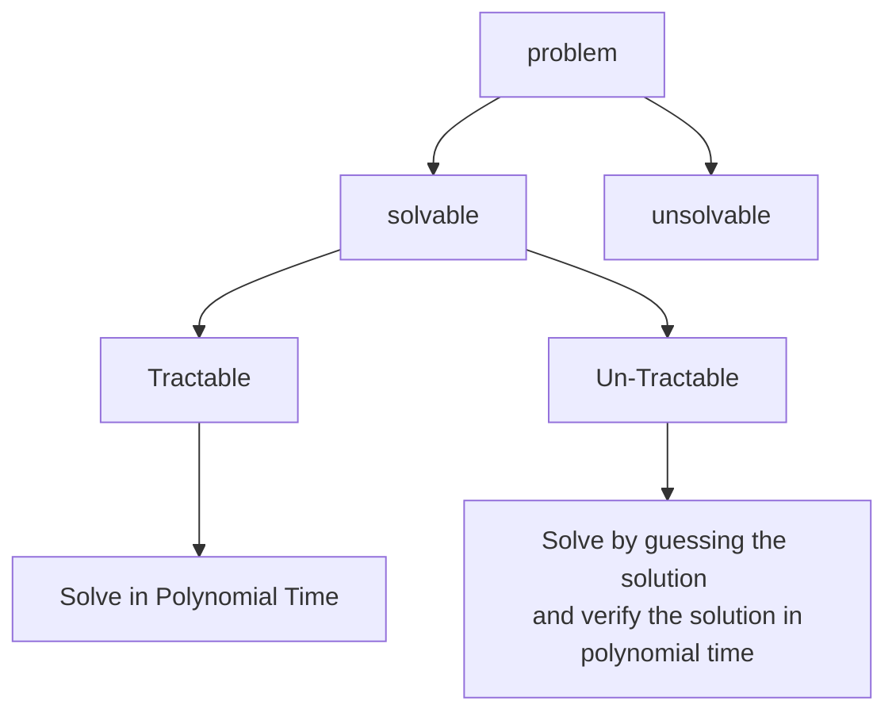
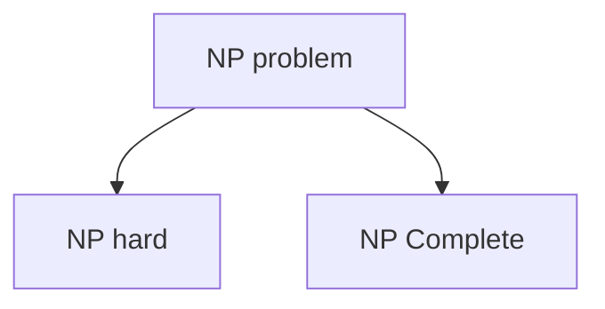

## The Class P

- $P = \set{L | \text{ Language } L}$
- These are problems solved by a deterministic algorithm in Polynomial time. (User knows the working time of every statement in algorithm).
- Problems can be solved in time $O(n^c)$ for some constant $c$, where $n$ is the size of input to the problem.

## The Class NP (Non Deterministic Polynomial)

- $NP = \set{L | \text{ Language } L}$
- These problems are solved by a Non-deterministic algorithm and verified in polynomial time.
	- User does not know execution time for few of the statements in the algorithm.

## Two Classes P & NP

- Initially every problem belongs to NP
	- Solved by Nondeterministic algorithms in polynomial time.
- Once the algorithm is found to solve the problem in polynomial time, it becomes a P class problem.
- ie. $P \subset NP$

## Need for NP

- Exponential time algorithms take more time than polynomial time algorithms for very large values of $n$.
- So there is need for polynomial time algorithms but it is unknown (Non-deterministic) in the present to reduce time of exponential complexity problems.

## The Class NP Hard

- A problem is said to be NP hard if every problem in NP can be reduced to polynomial time.
- $L_1 \le_p L_2$
- This notation means that problem $L_1$ is reducible to $L_2$ in polynomial time.
- Less symbol means that time taken to solve $L_1$ is no worse than a polynomial factor of time taken to solve $L_2$.

### Reducibility (Polynomial Transformation)

- $L_1 \subset \sum_1^* x$
- $L_2 \subset \sum_1^* f(x)$
- $f:\sum_1^* \rightarrow \sum_2^*$
- The following conditions should be satisfied for transformation
	- Polynomial time DTM program that compute $f$.
	- For all $x \in \sum_1^*$, $x \in L_1$, if $f(x) \in L_2$, then $L_1 \propto L_2$
- Property:
	1. If $L_1 \propto L_2$ and $L_2$ in $P$ then $L_1$ is in $P$.
	2. If $L_1 \propto L_2$ and $L_2$ not in $P$ then $L_1$ is not in $P$.

## NP Complete

- If problem satisfies both NP and NP-Hard then it is an NP complete problem.
- Problem can be solved in polynomial time if and only if all other NP complete problems can also be solved in polynomial time.
- If an NP hard problem can be solved in polynomial time, then all NP Complete problems can be solved in polynomial time.
- All NP complete problems are NP hard but some NP hard problems are not NP Complete.

### Theorems

>Theorem 1: If any NP Complete $Q$ is in $P$ then $P = NP$
>Proof:
>	Assume $R$ is NP complete.
>	Problem $Q$ is NP Hard and it reduces to R ($Q \propto R$)
>	That would mean that $Q$ is also NP Complete.
>	This any NP complete problem $R$ is in $P$ then $P = NP$.
>	

> Theorem 2: If any NP Complete $Q$ is in $P$ then $P \neq NP$
> Proof:
> 	Assume $R$ is not NP Complete.
> 	If no NP Complete is there, then no possibility of reduction for $Q$.
> 	Now $Q$ is also not NP Complete.
> 	Both $P$ and NP are separate.
> 	Thus, any NP complete problem is not in $P$ then $P \neq NP$.

### Satiability Problem - NP - Complete
- A boolean formula is satisfiable if there exists some assignment of the values $0$ and $1$ to its variables that causes it to evaluate to $1$ (TRUE).
- CNF -> Conjunctive Normal Form. ANDing of clauses of ORs.
- $3-SAT = \set{f | f \text { is in Conjuctive Normal Form, each clause has exactly 3 literals(x0, x1, x2) and f is satisfiable}}$
### NP completeness Proof Method
- To show that $Q$ is NP complete
	1. Show that $Q$ is in NP
	2. Pick an instance, $R$, of your favorite NP Complete problem.
	3. Show a polynomial algorithm to transform $R$ into an instance of $Q$.

## Vertex Cover
- Problem: To prove that vertex conver is an NP Complete problem.
- This proof involves reduction of a 3SAT problem to VERTEX COVER and involves the transformation of a boolean formula to something geometrical.

>Definition of Problem:
>- 3-SATISFIABILITY (3SAT)
>		- Instance: Set $U$ of variables, a collection $C$ of clauses over $U$ such that each clause $c$ in $C$ has size exactly $3$.
>		- Question: Is there a truth assignment for $U$ satisfying $C$.
>
> - Vertex Cover
> 		- Instance: An undirected graph $G$ and an integer $K$.
> 		- Question: Is there a vertex cover of size $K$ or less for $G$, i.e., a subset $V'$ of $V$ with the size of $V'$ less than $K$ such that every edge has at least one endpoint in $V'$

- Proof:
	- 3SAT is NP-Compelete.
	- Vertex cover is in NP because we can verify any solution in polytime with a simple $n^2$ examination of all the edges for endpoint inclusion in the given vertex cover.
	- For reduction, we take an instance of 3SAT (Boolean forumla) and reduce it to a vertex cover instance that has a cover if and only if 3SAT formula has a satisfying assignment. First thing we will do is force a choice for each variable to either True or False by having a pair of vertices for every literal and its' negation. 
	- An $x_i$ in $U$ will yield two vertices in $G$.
	- 
	- Next, create a gadget to represent the clauses (For each clause ($x_i, x_j, x_k$) we will create three vertex triangle where each vertex is connected to other two.) 
	- Finally choose an appropriate $K for vertex cover instance. Chooise $1 + 2m$ where 1 is the number of literals and $m$ is the number of clauses.
	- if there is a satisfying assignment of boolean 3SAT formula, then we can make the True literals part of vertex cover in $G$. That's 1 node in our cover. Also, by choosing one node for every literal, we've covered the edge between them. 
	- Next, notice that since we've satisfied the 3SAT formula, we have chosen at least one node whose outgoing edge is covered. 
	- Now we need only two vertices(or less) from each triangle to cover rest of the edges. This yields atmost $2m$ more vertices for a maxiumum total of $1 + 2m$ vertices in our cover.
	- Assume there is a vertex cover of $G$ with $1 + 2m$ vertices or less. 
	- Atleast one of the vertices is covering the literal pairs since the edge between them cannot be covered in any other way. The other $2m$ vertices must be covering the triangles since each triangle requires two vertices to be covered.
	- We take the literal nodes in the vertex cover to be our assignment of the formula. This assignment has to satisfy the forumla since every clause is satisfied by our gadget's construction. 
	- This construction takes $m$ clauses as an input and 1 literal and creates a graph with exactly $2l + 3m$ nodes. This can easily be done in polynomial time. 
	- VERTEX COVER is therefore NP Complete.

## Set Cover
- **Definition**: Given a set $U$ of elements, a collection $S_1, S_2, ..., S_m$ of subsets of $U$, and an integer $l$, there exists a collection of at most $k$ of these sets whose union is equal to $U$.

### Vertex Cover Reduces to Set Cover
- **Claim**: $\text{VERTEX-COVER}_p \le_p \text{SET-COVER}$
- Proof:
	- Given black box that solves instances of SET-COVER. Let $G = (V, E)$, $k$ be an instance of VERTEX-COVER.
	- Create SET-COVER instance:
		- $U = E$, $S_v = \set{e \in E : e \text{ incident to } v}$
		- Set-cover of size at most $k$ if and only if vertex cover of size at most $k$.

## Clique
- **Definition**: Given $N$ people and their pairwise relationships. Is there a group of $C$ people such that every pair in the group knows each other.

### Satisfiability Reduces to Clique
- **Claim**: $\text{CNF-SAT} \le_p \text{CLIQUE}$
	- Given an instance of CNF-SAT, create a person for each literal in each clause.
	- Two people know each other except if:
		- They come from the same clause.
		- They represent a literal and its negation.
	- Clique of size $C$ ==> satisfiable assignment.
		- set variable in clique to true.
		- (x, y, z) = (true, true, false) 
		- 
		- 