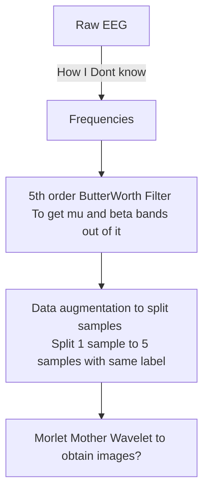

tags: #algorithm

![[Algorithm - A Transfer Learning-Based CNN And LSTM Hybrid Deep Learning Model To Classify Motor Imagery EEG Signals (2021) 2023-03-26 15.32.03.excalidraw]]
# Preprocessing

```mermaid
graph TD;
	RD[Raw EEG] --> |How I Dont know| Freq[Frequencies];
	Freq --> Butter[5th order ButterWorth Filter \nTo get mu and beta bands out of it];
	Butter --> DA[Data augmentation to split samples \nSplit 1 sample to 5 samples with same label];
	DA --> wavelet[Morlet Mother Wavelet to obtain images?];
```
