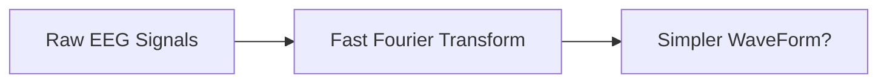

tags: #capstone #research_paper #eeg
**Farzi Paper lag rha hai**

- #useful [[Fast Fourier Analysis]] with [[EEG]] classification based brainwave controlled wheelchair.
- Project aims to increase mind power -> Focusing strength.
	- By increasing that, we reduce the risk of brain's degeneration.

